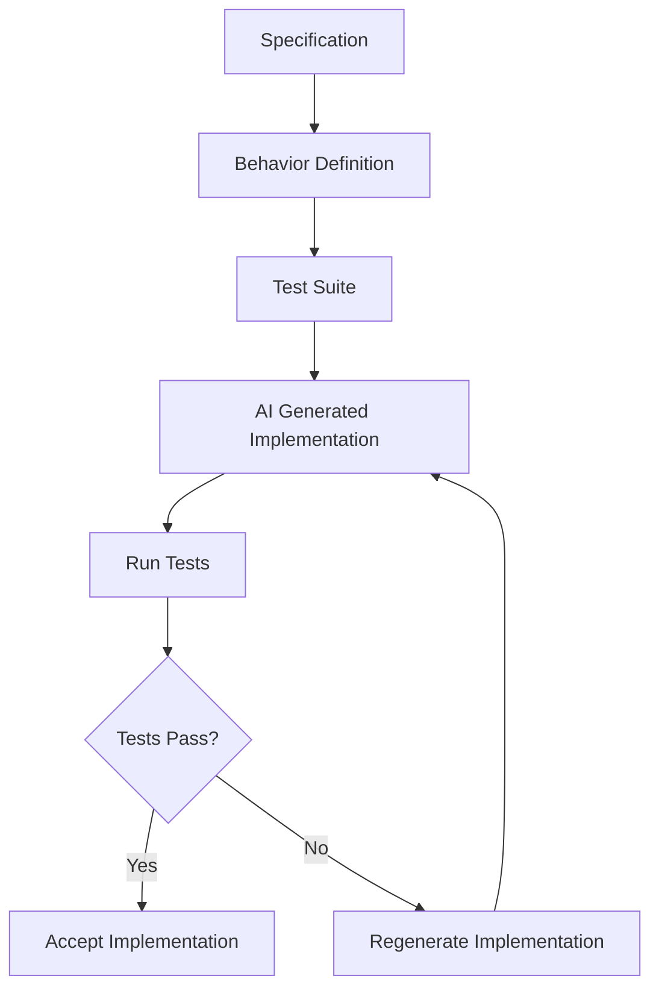
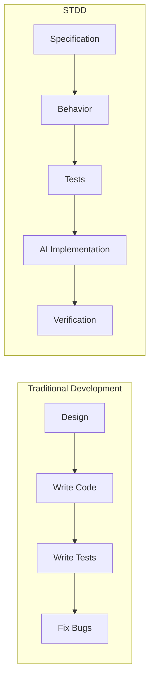

# STDD
## Specification & Test-Driven Development

A methodology for building stable software in the age of AI-generated code.

STDD shifts the focus of software engineering from **implementation** to **behavior**.

Instead of treating code as the core artifact, STDD defines systems using:

- specifications
- expected behavior
- executable tests

AI generates the implementation.

Tests guarantee the behavior.

---

# STDD Development Loop



Diagram source:  
`/diagrams/stdd_development_loop.md`

---

# Traditional Development vs STDD



Diagram source:  
`/diagrams/stdd_vs_traditional.md`

---

# Core Idea

**Code becomes disposable. Behavior becomes permanent.**

STDD ensures that system behavior remains stable even when implementations are regenerated by AI.

The specification defines what must happen.

The tests verify that behavior.

AI generates implementations that satisfy those tests.

---

# Core Documents

- **Manifesto** – Philosophy behind STDD
- **Method** – How STDD works in practice
- **Architecture** – Designing systems for safe regeneration
- **Examples** – Practical STDD development examples
- **Anti-Patterns** – Common mistakes to avoid
- **STDD vs Existing Methods** – Comparison with other approaches
- **Why AI Coding Needs STDD** – Stability in AI-generated systems
- **Engineering Playbook** – Applying STDD in real projects

---

# Repository Structure

Example layout:

```
stdd
│
├─ README.md
├─ STDD_method_v1_0.md
├─ STDD_architecture_v1_0.md
├─ STDD_examples_v1_0.md
├─ STDD_antipatterns_v1_0.md
├─ STDD_vs_existing_methods_v1_0.md
├─ STDD_why_ai_needs_stdd_v1_0.md
├─ STDD_engineering_playbook_v1_0.md
│
└─ diagrams
    ├─ stdd_development_loop.md
    ├─ stdd_control_loop.md
    ├─ stdd_vs_traditional.md
    ├─ stdd_architecture_layers.md
    └─ stdd_regeneration_model.md
```

---

# License

BSD
