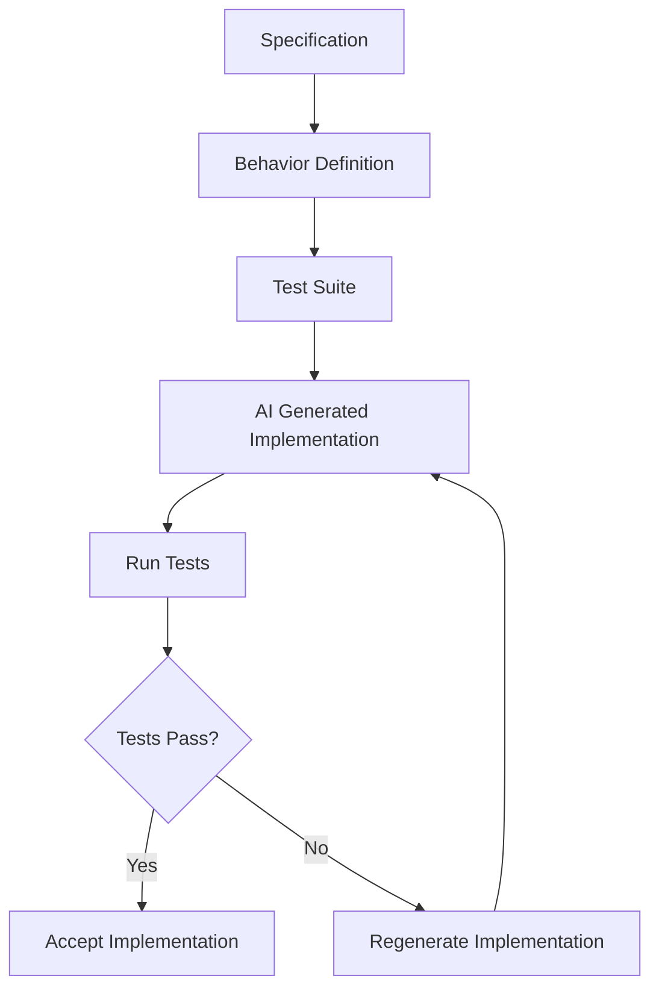

# STDD — Specification & Test-Driven Development

A software engineering methodology for the AI era.

Author: Frank Heikens

---

## The Core Idea

**Code is disposable. Behavior is permanent.**

STDD defines systems using specifications and tests. AI generates the implementation. If the implementation becomes outdated, complex, or broken, it is discarded and regenerated. The specifications and tests remain.

This is the **regeneration model**: code is deliberately disposable because the specification and test layers are strong enough to verify any new implementation from scratch.

---

## The Manifesto

- Specifications define intent.
- Tests verify behavior.
- Together, specifications and tests define the system.
- Implementations are replaceable artifacts.

Read the full [Manifesto](manifesto.md).

---

## How It Works

```
1. Define the specification
2. Define the expected behavior
3. Write tests that verify the behavior
4. Generate implementation with AI
5. Run the tests
6. Pass → accept. Fail → regenerate.
```



---

## Reading Guide

Start with the manifesto and method. Then go deeper based on your role.

### Philosophy

| Document | Description |
|----------|-------------|
| [Manifesto](manifesto.md) | Why STDD exists and what it stands for |

### Core Methodology

| Document | Description |
|----------|-------------|
| [Method](docs/method.md) | The STDD workflow — how it works in practice |
| [Writing Specifications](docs/writing-specifications.md) | How to write precise, testable specifications |
| [Architecture](docs/architecture.md) | Designing systems for safe regeneration |
| [NFR Framework](docs/nfr-framework.md) | Non-functional requirements as testable constraints |
| [Engineering Playbook](docs/engineering-playbook.md) | Applying STDD in real projects |
| [Versioning the Knowledge Layer](docs/versioning-the-knowledge-layer.md) | Version control for specifications and tests |
| [Features vs Implementations](docs/features-vs-implementations.md) | Language independence in STDD |

### Reference

| Document | Description |
|----------|-------------|
| [Anti-Patterns](reference/anti-patterns.md) | Common mistakes and how to avoid them |
| [STDD vs Existing Methods](reference/vs-existing-methods.md) | Comparison with TDD, BDD, and other approaches |
| [Why AI Needs STDD](reference/why-ai-needs-stdd.md) | The case for behavioral stability in AI-generated systems |

### Examples

| Document | Description |
|----------|-------------|
| [Seat Reservation API](examples/seat-reservation.md) | Full end-to-end walkthrough: specs, tests, implementation, regeneration |
| [Short Examples](examples/examples.md) | Single-feature STDD examples |

---

## Repository Structure

```
stdd/
├── README.md
├── manifesto.md
│
├── docs/
│   ├── method.md
│   ├── writing-specifications.md
│   ├── architecture.md
│   ├── nfr-framework.md
│   ├── engineering-playbook.md
│   ├── versioning-the-knowledge-layer.md
│   └── features-vs-implementations.md
│
├── reference/
│   ├── anti-patterns.md
│   ├── vs-existing-methods.md
│   └── why-ai-needs-stdd.md
│
├── examples/
│   ├── seat-reservation.md
│   └── examples.md
│
└── diagrams/
    ├── stdd_development_loop.md
    ├── stdd_control_loop.md
    ├── stdd_vs_traditional.md
    ├── stdd_architecture_layers.md
    └── stdd_regeneration_model.md
```

---

## License

Licensed under [Creative Commons Attribution 4.0 International (CC BY 4.0)](https://creativecommons.org/licenses/by/4.0/).

You are free to share and adapt this work, provided you give appropriate credit to the original author.

Author: Frank Heikens
