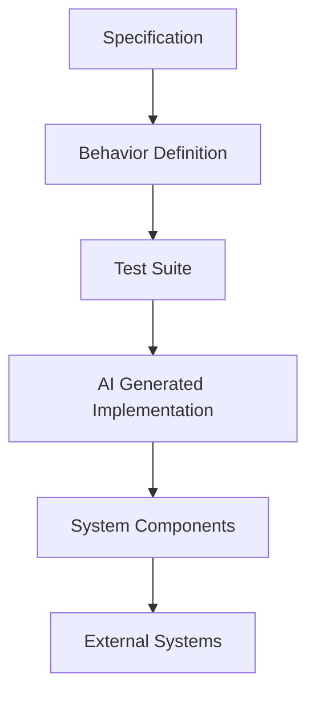

# STDD Architecture
## System Design for Specification & Test‑Driven Development

Author: Frank Heikens
Version: 1.0
Date: 2026

---

## Table of Contents

- [1. Introduction](#1-introduction)
- [2. Why Architecture Matters in STDD](#2-why-architecture-matters-in-stdd)
- [3. Deterministic Systems](#3-deterministic-systems)
- [4. Behavior Boundaries](#4-behavior-boundaries)
- [5. Contract‑Based Interfaces](#5-contract-based-interfaces)
- [6. Isolated Components](#6-isolated-components)
- [7. Managing Side Effects](#7-managing-side-effects)
- [8. Test Isolation](#8-test-isolation)
- [9. Regeneration Safe Zones](#9-regeneration-safe-zones)
- [10. System Evolution](#10-system-evolution)
- [11. Architecture Overview](#11-architecture-overview)

---

# 1. Introduction

Specification & Test‑Driven Development (STDD) changes how software is created.

Instead of treating code as the primary artifact, STDD treats **behavior as the core artifact**.  
Specifications define the expected behavior, tests verify that behavior, and AI generates the implementation.

For this model to work in real systems, the software architecture must support:

- deterministic behavior
- clear component boundaries
- testable contracts
- isolated components
- controlled side effects

Without the right architecture, regeneration of implementations becomes unsafe or unpredictable.

This document describes the architectural principles that allow STDD to work reliably in production systems.

---

# 2. Why Architecture Matters in STDD

In traditional development, code is written manually and evolves incrementally.

In STDD, implementations may be regenerated many times. This introduces a new requirement:

> The architecture must allow implementations to be replaced without changing system behavior.

This requires:

- clear behavioral boundaries
- strong test coverage
- deterministic execution
- minimal hidden dependencies

Architecture ensures that regenerated implementations continue to satisfy the system specification.

---

# 3. Deterministic Systems

STDD relies on repeatable behavior.

Tests must produce the same results every time they are executed.

Non‑deterministic systems make regeneration dangerous because passing tests cannot reliably prove correctness.

Examples of non‑deterministic behavior:

- reliance on system time
- random number generation without fixed seeds
- external services with unpredictable responses
- hidden global state

Where non‑determinism is unavoidable, it must be **controlled and isolated**.

---

# 4. Behavior Boundaries

Systems must be divided into **behavioral components** that can be tested independently.

Each component should represent a well‑defined responsibility.

Example layered architecture:

```
Client / API
     ↓
Application Services
     ↓
Domain Logic
     ↓
Data Access Layer
     ↓
Database
```

Each layer communicates through clearly defined interfaces.

This ensures that behavior can be tested and validated at each level.

---

# 5. Contract‑Based Interfaces

Components interact through **contracts**.

A contract defines:

- input
- output
- constraints
- failure conditions

Example contract:

```
calculate_total(cart, tax_rate) -> total_price
```

The contract is validated through tests.

Implementations may change, but the contract must remain stable.

---

# 6. Isolated Components

Components must be independently testable.

This means:

- minimal shared state
- limited coupling
- clear input/output boundaries

Preferred characteristics:

- stateless services
- pure functions where possible
- dependency injection for external services

This allows individual components to be regenerated without affecting the rest of the system.

---

# 7. Managing Side Effects

Most real systems interact with external systems such as:

- databases
- message queues
- APIs
- file systems

These interactions create **side effects**.

Side effects must be isolated behind interfaces so they can be mocked or simulated during tests.

Example abstraction:

```
PaymentGateway
    process_payment()
```

During tests this interface can be replaced with a mock implementation.

---

# 8. Test Isolation

Tests must run independently and produce deterministic results.

Requirements for test isolation:

- no shared mutable state
- predictable test data
- isolated test environments
- independent execution

Isolated tests allow safe regeneration of implementations without risking hidden dependencies.

---

# 9. Regeneration Safe Zones

In STDD architectures, certain parts of the system can be regenerated safely.

Examples:

- business logic
- data transformations
- validation logic
- algorithmic components

Other parts of the system should remain stable.

Examples:

- database schema
- external integrations
- security boundaries
- infrastructure configuration

Separating these areas ensures that regeneration does not introduce instability.

---

# 10. System Evolution

Systems evolve as requirements change.

In STDD, evolution follows a controlled process:

1. Update the specification
2. Add or update tests
3. Regenerate the implementation
4. Verify that all tests pass

Architecture must support this process by ensuring that regenerated components remain isolated and predictable.

---

# 11. Architecture Overview

The following diagram illustrates how STDD fits into system architecture.



Specifications and tests define system behavior.

AI generates implementations that satisfy the tests.

Architecture ensures that components remain testable and replaceable.

---

# Conclusion

STDD requires systems to be designed differently from traditional architectures.

The goal is not only maintainability, but **safe regeneration of implementations**.

By enforcing:

- deterministic execution
- contract‑based interfaces
- isolated components
- controlled side effects

STDD architectures allow AI‑generated implementations to evolve while preserving system behavior.

Specifications and tests remain the ultimate source of truth.
