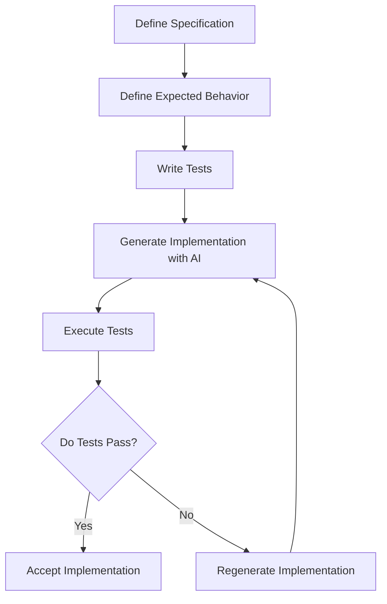

# The STDD Method
## Specification & Test-Driven Development in Practice

Author: Frank Heikens  
Version: 1.0  
Date: 2026

---

## Table of Contents

- [1. Introduction](#1-introduction)
- [2. Why STDD Exists](#2-why-stdd-exists)
- [3. Core Principles](#3-core-principles)
- [4. STDD Workflow](#4-stdd-workflow)
- [5. Role of Specifications](#5-role-of-specifications)
- [6. Role of Tests](#6-role-of-tests)
- [7. Role of AI](#7-role-of-ai)
- [8. Code Generation Cycle](#8-code-generation-cycle)
- [9. Regeneration Loop](#9-regeneration-loop)
- [10. Maintaining System Stability](#10-maintaining-system-stability)
- [11. Example STDD Workflow](#11-example-stdd-workflow)

---

# 1. Introduction

Artificial Intelligence can now generate software faster than any human engineer.

However, speed alone does not produce reliable systems.

The challenge of modern software development is no longer writing code.  
The challenge is ensuring that systems behave correctly over time.

Traditional development methods treat **code as the central artifact**.

But when code can be generated instantly by AI, the focus must shift.

In **Specification & Test-Driven Development (STDD)** the true definition of a system is not the code.

The system is defined by:

- The **specification**
- The **expected behavior**
- The **tests that verify that behavior**

Code becomes an implementation detail.

STDD provides a structured workflow where AI generates implementations while specifications and tests guarantee system stability.

---

# 2. Why STDD Exists

AI has fundamentally changed the economics of software development.

Previously:

- Writing code was expensive
- Code was maintained manually
- Implementation stability depended heavily on human discipline

With AI:

- Code can be generated instantly
- Implementations can be regenerated repeatedly
- The limiting factor becomes **clarity of requirements**

This creates a new risk.

AI can generate working code that **passes today but fails tomorrow**.

Without strong behavioral definitions, systems accumulate fragile implementations.

STDD solves this by ensuring that:

> **Behavior is defined before implementation exists.**

This makes the system stable even when implementations change.

---

# 3. Core Principles

STDD is built on several fundamental principles.

## Behavior Defines the System

The system is defined by **what it does**, not how it is implemented.

## Tests Define Reality

If a behavior cannot be tested, it does not exist.

Tests are the ultimate verification of correctness.

## Implementation is Replaceable

Code can be regenerated at any time as long as the tests continue to pass.

## Specifications Must Be Precise

Ambiguous specifications lead to unstable implementations.

Specifications must be precise and testable.

## AI Generates, Humans Define

Humans define system behavior.

AI generates the implementation.

---

# 4. STDD Workflow

STDD enforces a structured workflow where behavior is defined before implementation.

The development process follows this sequence:

1. Define the specification  
2. Define expected behavior  
3. Define tests  
4. Generate implementation  
5. Execute tests  
6. If tests fail → regenerate implementation  
7. If tests pass → accept implementation  

---

## STDD Development Cycle



---

# 5. Role of Specifications

The specification describes **what the system must do**.

Specifications must be:

- Precise
- Unambiguous
- Testable
- Independent of implementation details

Specifications define:

- System responsibilities
- Inputs and outputs
- Functional requirements
- Constraints
- Failure conditions

### Example Specification

> The system must return the total price of items in a shopping cart including tax.  
> The tax rate must be configurable per region.

The specification defines **what must happen**, not **how it should be implemented**.

A complete specification includes behavioral scenarios, invariants, failure conditions, and structured acceptance cases. For detailed guidance on writing specifications, see **Writing Specifications in STDD**.

---

# 6. Role of Tests

Tests translate specifications into **verifiable system behavior**.

Tests serve several purposes:

- Verify correctness
- Prevent regressions
- Enable safe regeneration of code
- Provide executable documentation

Tests should cover:

- Normal scenarios
- Edge cases
- Failure conditions
- Security constraints

### Example Behavior Test

```python
def test_total_price():
    items = [10, 20]
    tax_rate = 0.10

    result = calculate_total(items, tax_rate)

    assert result == 33
```

This test defines the expected behavior.

Any implementation must satisfy this test.

---

# 7. Role of AI

AI is responsible for **generating implementations** that satisfy the tests.

AI is **not responsible for defining behavior**.

This separation ensures:

- Humans control system behavior
- AI accelerates implementation

AI can be used to:

- Generate code
- Refactor code
- Optimize implementations
- Translate implementations across languages

Because behavior is enforced by tests, implementations can evolve without destabilizing the system.

---

# 8. Code Generation Cycle

Once specifications and tests exist, the implementation can be generated.

The cycle works as follows:

1. Provide the specification to the AI
2. Provide the test suite
3. Generate the implementation
4. Execute tests

If the implementation satisfies all tests, it is accepted.

If tests fail, the implementation is discarded and regenerated.

Because AI can generate code quickly, multiple attempts can be made until the tests pass.

---

# 9. Regeneration Loop

One of the most powerful features of STDD is the **regeneration loop**.

If code becomes difficult to maintain or optimize, the implementation can simply be regenerated.

Process:

1. Keep specification
2. Keep tests
3. Generate new implementation
4. Execute tests
5. Accept if tests pass

This makes implementations **disposable**.

System stability comes from the specification and tests, not from preserving the original code.

---

# 10. Maintaining System Stability

System stability in STDD is guaranteed by three elements.

## Specifications

Define what the system must do.

## Tests

Verify that the behavior remains correct.

## Regeneration

Allows implementations to evolve safely.

When a system evolves:

1. The specification is updated
2. New tests are added
3. The implementation is regenerated

This ensures system behavior evolves in a controlled and verifiable way.

---

# 11. Example STDD Workflow

A simple STDD development cycle:

```
1 Define specification
2 Define behavior
3 Define tests
4 Generate implementation
5 Execute tests
6 If tests fail → regenerate
7 If tests pass → accept implementation
```

In STDD:

- Specifications define **what must happen**
- Tests verify **that it happens correctly**
- AI generates **how it happens**

The system remains stable even if the implementation changes.

---

# Conclusion

Specification & Test-Driven Development shifts the foundation of software engineering.

Instead of treating code as the core artifact, STDD treats **behavior as the core artifact**.

Specifications define the system.  
Tests enforce the behavior.  
AI generates the implementation.

This allows software systems to evolve safely in an era where code can be generated instantly.

STDD turns AI from a risk into a controlled engineering tool.

---

For the philosophy behind STDD see:

**The STDD Manifesto**
