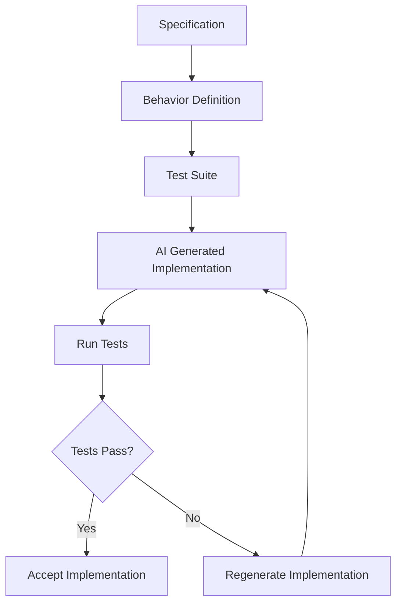
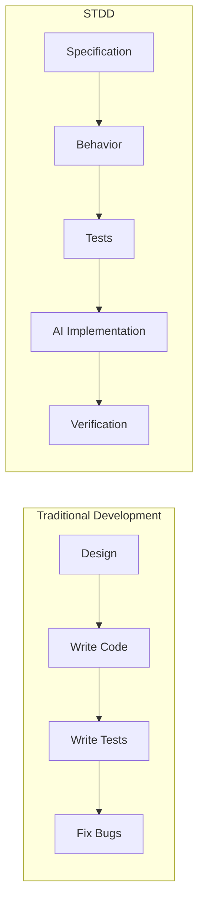
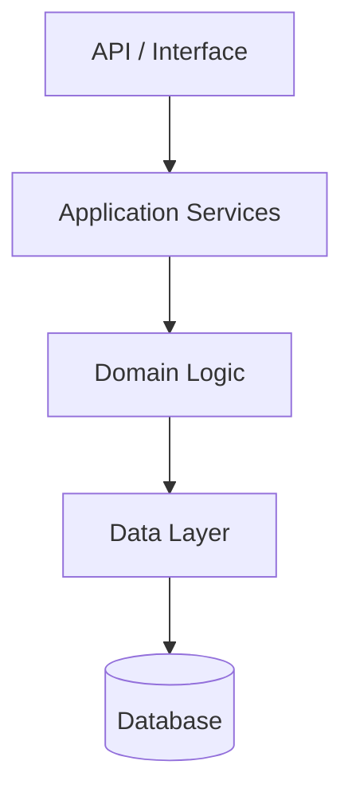

# STDD Overview
## Specification & Test-Driven Development

Author: Frank Heikens
Version: 1.0
Date: 2026

---

STDD shifts the focus of software engineering from **implementation** to **behavior**.

**Code becomes disposable. Behavior becomes permanent.**

Specifications define the system.  
Tests verify the behavior.  
AI generates implementations that satisfy those tests.

---

# 1. STDD Development Loop

---

# 2. Traditional Development vs STDD

---

# 3. STDD Architecture Layers

---

# Summary

STDD builds on established ideas like TDD and BDD. Its central innovation is the **regeneration model**: implementations are deliberately disposable because the specification and test layers are strong enough to verify any new implementation from scratch.

The key principles are:

- **Regeneration is a normal operation**, not an emergency measure
- **Specifications and tests form a permanent knowledge layer** above the code
- **Code is deliberately disposable** and can be discarded and regenerated at any time
- **AI generates implementations** that the knowledge layer verifies

By treating code as temporary and behavior as permanent, STDD allows systems to evolve safely even when large portions of the code are regenerated by AI.
