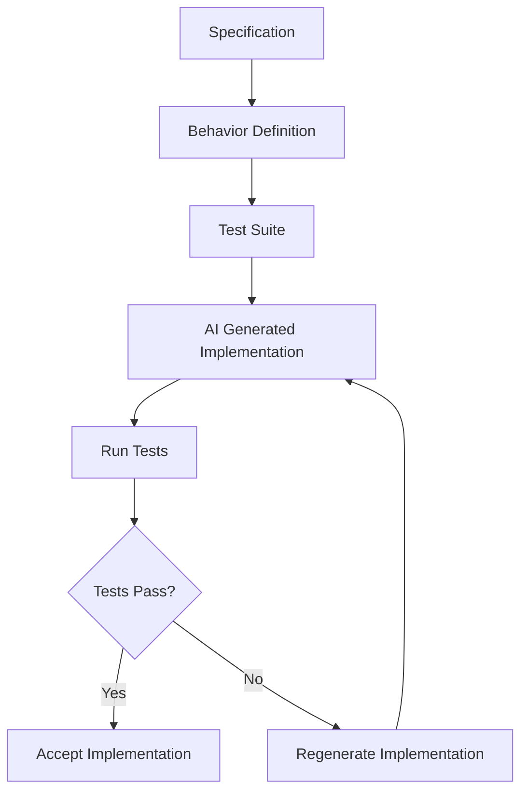
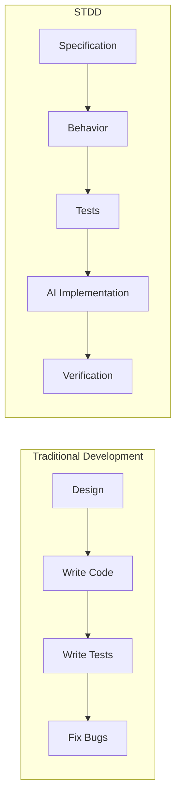
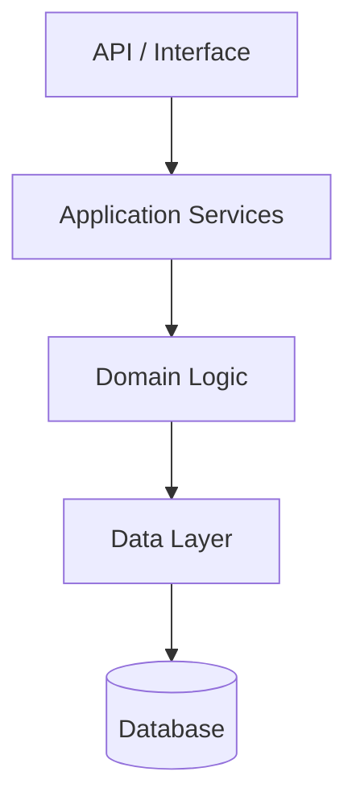

# STDD Overview
## Specification & Test-Driven Development

Author: Frank Heikens
Version: 1.0
Date: 2026

---

STDD shifts the focus of software engineering from **implementation** to **behavior**.

**Code becomes disposable. Behavior becomes permanent.**

Specifications define the system.  
Tests verify the behavior.  
AI generates implementations that satisfy those tests.

---

# 1. STDD Development Loop

---

# 2. Traditional Development vs STDD

---

# 3. STDD Architecture Layers

---

# Summary

STDD provides a structured approach to AI-assisted software development.

The key principles are:

- **Specifications define behavior**
- **Tests verify behavior**
- **AI generates implementations**
- **Implementations remain replaceable**

By placing behavior at the center of development, STDD allows systems to evolve safely even when large portions of the code are generated by AI.
