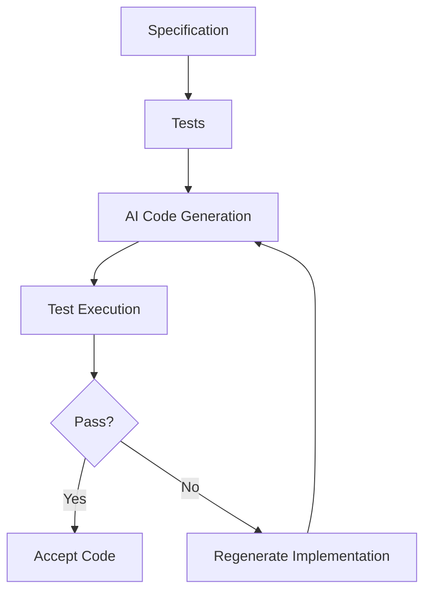

# STDD Control Loop

```mermaid
flowchart TD

A[Specification]
B[Tests]
C[AI Code Generation]
D[Test Execution]
E{Pass?}

A --> B
B --> C
C --> D
D --> E
E -- Yes --> Accept[Accept Code]
E -- No --> Regenerate[Regenerate Implementation]
Regenerate --> C
```
