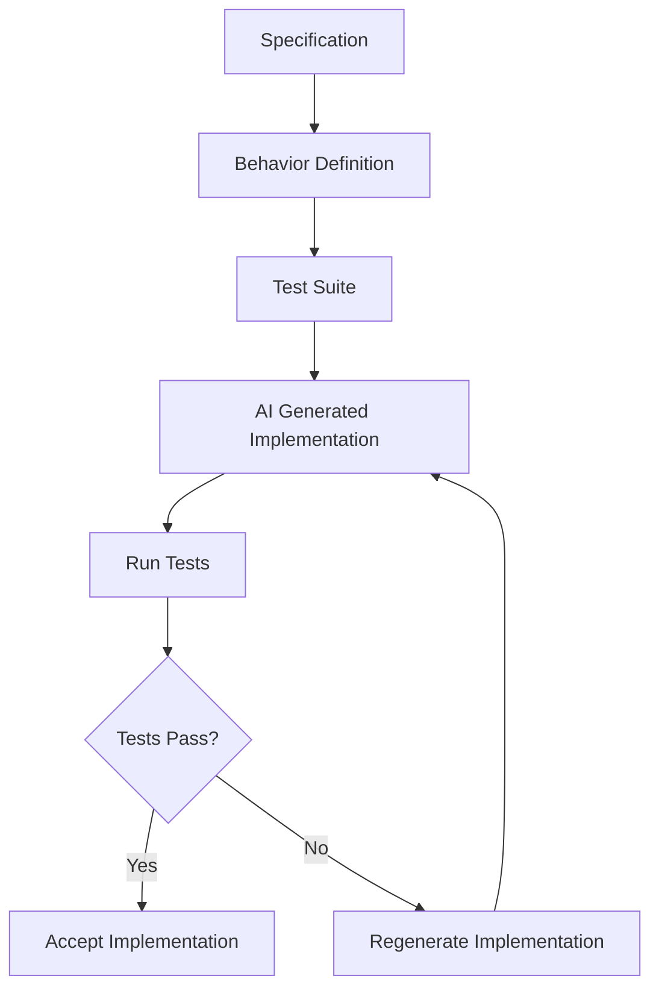

# STDD Development Loop

```mermaid
flowchart TD

A[Specification]
B[Behavior Definition]
C[Test Suite]
D[AI Generated Implementation]
E[Run Tests]
F{Tests Pass?}
G[Accept Implementation]
H[Regenerate Implementation]

A --> B
B --> C
C --> D
D --> E
E --> F
F -- Yes --> G
F -- No --> H
H --> D
```
