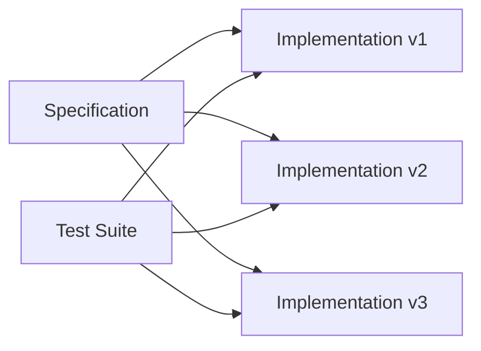

# STDD Regeneration Model

```mermaid
flowchart LR

Spec[Specification]
Tests[Test Suite]

Spec --> Impl1[Implementation v1]
Spec --> Impl2[Implementation v2]
Spec --> Impl3[Implementation v3]

Tests --> Impl1
Tests --> Impl2
Tests --> Impl3
```
