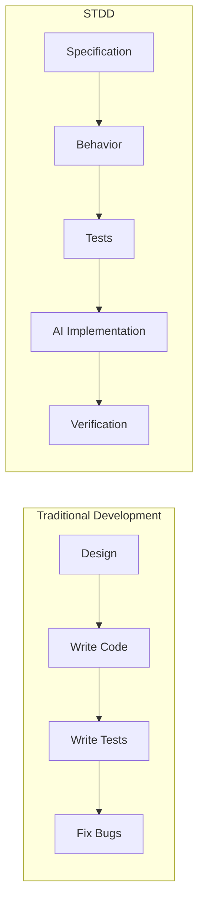

# Traditional Development vs STDD

```mermaid
flowchart LR

subgraph Traditional Development
A1[Design]
B1[Write Code]
C1[Write Tests]
D1[Fix Bugs]
end

subgraph STDD
A2[Specification]
B2[Behavior]
C2[Tests]
D2[AI Implementation]
E2[Verification]
end

A1 --> B1 --> C1 --> D1
A2 --> B2 --> C2 --> D2 --> E2
```
