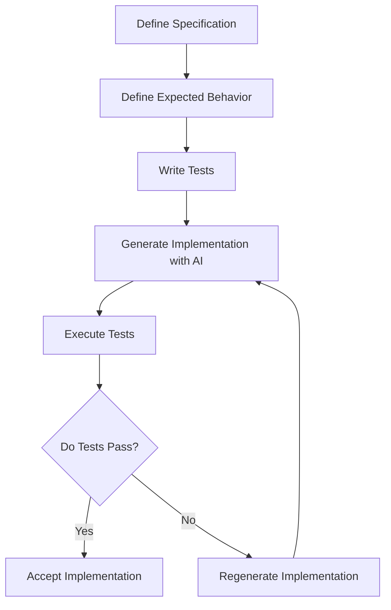

# The STDD Method
## Specification & Test-Driven Development in Practice

Author: Frank Heikens  
Version: 1.0  
Date: 2026

---

## Table of Contents

- [1. Introduction](#1-introduction)
- [2. Why STDD Exists](#2-why-stdd-exists)
- [3. Core Principles](#3-core-principles)
- [4. STDD Workflow](#4-stdd-workflow)
- [5. Role of Specifications](#5-role-of-specifications)
- [6. Role of Tests](#6-role-of-tests)
- [7. Role of AI](#7-role-of-ai)
- [8. Code Generation Cycle](#8-code-generation-cycle)
- [9. Regeneration Loop](#9-regeneration-loop)
- [10. The Specification Pyramid](#10-the-specification-pyramid)
- [11. When Regeneration Fails](#11-when-regeneration-fails)
- [12. Maintaining System Stability](#12-maintaining-system-stability)
- [13. Example STDD Workflow](#13-example-stdd-workflow)

---

# 1. Introduction

Artificial Intelligence can now generate software faster than any human engineer.

However, speed alone does not produce reliable systems.

The challenge of modern software development is no longer writing code.  
The challenge is ensuring that systems behave correctly over time.

Traditional development methods treat **code as the central artifact**.

But when code can be generated instantly by AI, the focus must shift.

In **Specification & Test-Driven Development (STDD)** the true definition of a system is not the code.

The system is defined by:

- The **specification**
- The **expected behavior**
- The **tests that verify that behavior**

Code becomes an implementation detail.

STDD provides a structured workflow where AI generates implementations while specifications and tests guarantee system stability.

---

# 2. Why STDD Exists

AI has fundamentally changed the economics of software development.

Previously:

- Writing code was expensive
- Code was maintained manually
- Implementation stability depended heavily on human discipline

With AI:

- Code can be generated instantly
- Implementations can be regenerated repeatedly
- The limiting factor becomes **clarity of requirements**

This creates a new risk.

AI can generate working code that **passes today but fails tomorrow**.

Without strong behavioral definitions, systems accumulate fragile implementations.

STDD solves this by ensuring that:

> **Behavior is defined before implementation exists.**

This makes the system stable even when implementations change.

---

# 3. Core Principles

STDD is built on several fundamental principles.

## Regeneration is the Core Operation

The central innovation of STDD is the **regeneration loop**: the ability to discard and regenerate implementations at any time because the specification and test layers are strong enough to verify any new implementation from scratch.

Regeneration is not an emergency measure. It is a normal operation. Code is deliberately disposable.

## Behavior Defines the System

The system is defined by **what it does**, not how it is implemented.

## Tests Define Reality

If a behavior cannot be tested, it does not exist.

Tests are the ultimate verification of correctness.

## The Specification Layer Makes Regeneration Safe

TDD established that tests come before code. STDD adds a specification layer above the tests: behavioral scenarios, invariants, acceptance cases, failure conditions, and constraints.

This layer captures intent that tests alone cannot express. Together, the specification and tests form a **knowledge layer** strong enough to safely regenerate any implementation.

## Specifications Must Be Precise

Ambiguous specifications lead to unstable implementations.

Specifications must be precise and testable.

## AI Generates, Humans Define

Humans define system behavior.

AI generates the implementation.

---

# 4. STDD Workflow

STDD enforces a structured workflow where behavior is defined before implementation.

The development process follows this sequence:

1. Define the specification  
2. Define expected behavior  
3. Define tests  
4. Generate implementation  
5. Execute tests  
6. If tests fail → regenerate implementation  
7. If tests pass → accept implementation

This is the canonical flow for new features. Variations exist for other scenarios: behavior changes start with updating the existing specification; bug fixes where the specification already defines the correct behavior may proceed directly to fixing the implementation; and discovery work on existing systems starts by extracting the specification from observed behavior. See the [Core Model](stdd-core-model.md) for all execution flows.

---

## STDD Development Cycle



---

# 5. Role of Specifications

The specification describes **what the system must do**.

Specifications must be:

- Precise
- Unambiguous
- Testable
- Independent of implementation details

Specifications define:

- System responsibilities
- Inputs and outputs
- Functional requirements
- Constraints
- Failure conditions

### Example Specification

> The system must return the total price of items in a shopping cart including tax.  
> The tax rate must be configurable per region.

The specification defines **what must happen**, not **how it should be implemented**.

A complete specification includes behavioral scenarios, invariants, failure conditions, and structured acceptance cases. For detailed guidance on writing specifications, see [Writing Specifications](writing-specifications.md).

---

# 6. Role of Tests

Tests translate specifications into **verifiable system behavior**.

Tests serve several purposes:

- Verify correctness
- Prevent regressions
- Enable safe regeneration of code
- Provide executable documentation

Tests should cover:

- Normal scenarios
- Edge cases
- Failure conditions
- Security constraints

### Example Behavior Test

```python
def test_total_price():
    items = [10, 20]
    tax_rate = 0.10

    result = calculate_total(items, tax_rate)

    assert result == 33
```

This test defines the expected behavior.

Any implementation must satisfy this test.

The translation from specification to tests is a critical step. Every scenario, invariant, and failure condition in the specification must be covered by at least one test. A traceability matrix, generated tests from acceptance cases, and property-based invariant tests help close this gap. For detailed strategies, see [Writing Specifications](writing-specifications.md), Section 13.

---

# 7. Role of AI

AI is responsible for **generating implementations** that satisfy the tests.

AI is **not responsible for defining behavior**.

This separation ensures:

- Humans control system behavior
- AI accelerates implementation

AI can be used to:

- Generate code
- Refactor code
- Optimize implementations
- Translate implementations across languages

Because behavior is enforced by tests, implementations can evolve without destabilizing the system.

---

# 8. Code Generation Cycle

Once specifications and tests exist, the implementation can be generated.

The cycle works as follows:

1. Provide the specification to the AI
2. Provide the test suite
3. Generate the implementation
4. Execute tests

If the implementation satisfies all tests, it is accepted.

If tests fail, the implementation is discarded and regenerated.

Because AI can generate code quickly, multiple attempts can be made until the tests pass.

---

# 9. Regeneration Loop

The **regeneration loop** is the central mechanism that distinguishes STDD from traditional test‑first approaches.

TDD and BDD also place tests before implementation. But they assume that code is maintained incrementally. Refactoring improves existing code. The implementation accumulates history and implicit knowledge over time.

STDD takes a different position: **code is deliberately disposable**.

If an implementation becomes difficult to maintain, inefficient, or outdated, it is not refactored. It is discarded and regenerated.

Process:

1. Keep specification
2. Keep tests
3. Discard existing implementation
4. Generate new implementation
5. Execute tests
6. Accept if tests pass

This is only safe when the specification and test layers are strong enough to fully define the expected behavior. A weak specification or incomplete test suite makes regeneration dangerous.

The quality of the regeneration loop depends entirely on the quality of the knowledge layer above the code.

System stability comes from the specification and tests, not from preserving the original code.

---

# 10. The Specification Pyramid

A single well-specified function is easy to regenerate. But real systems are not single functions. They are compositions: functions call other functions, components depend on components, services interact across boundaries.

The specification pyramid ensures that compositions are tested, not just individual parts.

## Four Levels

```
        ┌─────────────┐
        │   System     │  Full workflows across all components
        │   Specs      │  "Customer holds seat, confirms, receives ticket"
        ├─────────────┤
        │  Integration │  Multiple components working together
        │   Specs      │  "Confirmation uses pricing and updates inventory"
        ├─────────────┤
        │  Component   │  One component, internal function interactions
        │   Specs      │  "ReservationService handles hold-to-confirm flow"
        ├─────────────┤
        │    Unit      │  Single function, one responsibility
        │    Specs     │  "calculate_price returns correct decimal"
        └─────────────┘
```

**Unit level.** A single function with a single responsibility. Maximum ~50 lines. Clear inputs, outputs, invariants, and failure conditions. This is the most common level in any STDD project, and the easiest to regenerate.

**Component level.** Multiple functions within one component working together. For example, `ReservationService.hold_seat()` internally checks seat availability, creates a hold record, and updates seat status. A component-level test verifies the sequence produces the correct outcome without testing each internal step separately.

**Integration level.** Multiple components collaborating. For example, confirming a reservation requires the `ReservationService`, the `PricingEngine`, and the `SeatInventory` to interact correctly. Integration tests verify that the contracts between components hold.

**System level.** Full end-to-end workflows that cross all components. For example: customer lists seats, holds one, confirms it, and the seat disappears from the available list. System tests verify that the complete user-visible behavior works as specified.

## Each Level Has Its Own Specifications

This is the key principle. You do not simply write unit tests and hope the composition works. You write specifications at each level.

A unit specification says: "calculate_price returns the base price multiplied by the event multiplier, with group discount applied for groups of 4 or more."

An integration specification says: "When a hold is confirmed, the price returned to the customer matches the price that would be calculated by the PricingEngine for that seat's section and event."

A system specification says: "After a customer confirms a reservation, the seat no longer appears in the available seats list for that event."

Each specification has its own tests. Each test maps back to its specification through the traceability matrix.

## Behavioral Specifications vs Integration Mappings

At the integration and system levels, two kinds of specification coexist. Keeping them distinct prevents a common source of confusion.

A **behavioral specification** defines correctness — what the system must do. If the statement is violated, the system is wrong.

An **integration mapping** defines a contract or adaptation — how components connect, how external data is translated, or what protocol is used at a boundary. If the mapping is violated, the wiring is broken.

Both are needed at the integration level. They answer different questions.

**Examples from the seat reservation system:**

| Statement | Type | Why |
|---|---|---|
| "An expired hold cannot be confirmed" | Behavioral | Defines intended behavior. Violating it means the system allows invalid reservations. |
| "After a failed confirmation of an expired hold, the seat returns to available" | Behavioral | Defines a correctness rule for a specific failure path. |
| "PricingEngine.calculate() returns Decimal with 2 decimal places" | Integration mapping | Defines the contract between ReservationService and PricingEngine. |
| "ReservationService catches pricing errors and reports them to the caller" | Integration mapping | Defines how the caller handles dependency failures. |

**The rule:** If the statement defines what the system should do — intended behavior, correctness invariants, business rules — it is behavioral. If the statement explains how data flows across a boundary, what format a dependency uses, or how external system responses are mapped — it is an integration mapping.

This does not mean that integration-level work is "merely mapping." Most integration-level specifications contain both behavioral rules (what the composed system must do) and contract rules (how the components connect). Both are important. The distinction matters because they have different test types, different traceability, and different maintenance patterns. See the [Core Model](stdd-core-model.md), Section 2, for the full taxonomy.

## Why Unit Tests Alone Are Not Enough

Unit tests verify that each function does the right thing in isolation. But bugs hide in the gaps between functions:

- **Contract mismatches.** Function A returns a value that function B interprets differently. Both pass their unit tests.
- **Ordering assumptions.** Component A assumes it is called before component B. Nothing in the unit tests enforces this.
- **State leakage.** One component modifies shared state in a way another component does not expect.
- **Timing dependencies.** A hold expiry check and a confirmation check race against each other. Each works individually.

Integration and system tests catch these bugs because they test the composition, not just the parts.

## Guiding AI with the Pyramid

When instructing AI to generate implementations, the specification pyramid provides natural decomposition guidance:

1. **Start with the system specification.** Define the end-to-end workflow the user expects.
2. **Identify the components** needed to fulfill that workflow.
3. **Specify each component** with its own inputs, outputs, and failure conditions.
4. **Specify each function** within each component.
5. **Write tests at every level** — unit, component, integration, system.

The AI receives the specifications and tests for one unit at a time. Each unit is small enough to regenerate reliably. But the integration and system tests verify that the regenerated unit still works within the larger system.

This is what makes regeneration safe at scale: not just unit tests, but a full pyramid of specifications and tests that catch composition bugs.

For a worked example showing all four levels in practice, see [Seat Reservation API](../examples/seat-reservation.md).

---

# 11. When Regeneration Fails

STDD's regeneration model depends on AI reliably producing correct implementations from specifications and tests. This usually works for well-decomposed functions under approximately 50 lines. But it is not guaranteed, and practitioners should understand where the model has limits.

## Diagnosis, Not Blame

When AI generates code that fails tests, the first step is diagnosis — not retrying blindly.

**Read the test failure.** The failing test tells you which specification the AI violated. This is the most important signal. A test that expected a `Decimal("150.00")` but received `150.0` tells you the AI used float arithmetic instead of decimal. A test that expected `"Hold has expired"` but received `"Hold not found"` tells you the expiry logic is in the wrong place.

**Check the specification.** If the AI consistently misunderstands a requirement, the specification may be ambiguous. A specification that says "the price includes a discount" is weaker than one that says "group discount of 10% applies for groups of 4 or more, calculated as unit_price × (1 - 0.10), rounded to 2 decimal places." The more precise the specification, the more likely AI generates correct code on the first attempt.

**Check the decomposition.** If a function is too large or has too many responsibilities, AI is more likely to get part of it wrong. Break it into smaller functions, each with its own specification and tests. A 50-line function with 5 tests is trivially regenerable. A 200-line function with 15 interacting concerns is not.

## Common Failure Patterns

**Arithmetic precision.** AI frequently defaults to floating-point arithmetic even when the specification requires decimal. Tests that compare exact decimal values catch this immediately. The fix is to make the constraint explicit in the prompt: "Use Decimal arithmetic, not float."

**Edge case omission.** AI may generate code that handles the main path correctly but misses edge cases. This is why STDD requires specifications to enumerate failure conditions explicitly. Every failure condition should have a test. If the AI misses one, the test catches it.

**State management errors.** When multiple operations modify shared state, AI may generate code that handles each operation correctly in isolation but fails when operations are interleaved. This is why the specification pyramid includes integration and system tests. Unit tests alone will not catch state interaction bugs.

**Contract mismatches between components.** When regenerating one component, the new implementation may subtly violate the contract expected by another component. Integration tests catch this. If they do not, the integration specification needs strengthening.

## What Not to Do

**Never weaken a test to make AI-generated code pass.** The test represents the specification. If the AI cannot satisfy it, the prompt needs work — not the test. Weakening a test to accommodate a flawed implementation is the most dangerous anti-pattern in STDD.

**Never retry without changing the prompt.** If AI generates incorrect code, running the same prompt again usually produces the same mistake. Change the prompt: add more context, highlight the constraint that was missed, provide an example of the expected output, or break the task into smaller pieces.

**Never skip integration and system tests after regeneration.** A regenerated unit may pass all its unit tests while breaking a workflow that depends on it. Always run the full test pyramid after regeneration.

## Limits of the Model

STDD does not claim that AI can generate arbitrarily complex systems from specifications alone. The model works because it forces decomposition into small, well-specified units that are within AI's reliable generation capability.

Systems that resist decomposition — tightly coupled legacy code, deeply stateful algorithms, or code that depends on undocumented external behavior — are harder to apply STDD to. The adoption path for these systems starts with writing specifications and tests for the existing behavior before attempting regeneration. See [Architecture](architecture.md) for guidance on designing systems that support safe regeneration.

---

# 12. Maintaining System Stability

System stability in STDD is guaranteed by three elements.

## Specifications

Define what the system must do.

## Tests

Verify that the behavior remains correct.

## Regeneration

Allows implementations to evolve safely.

When a system's intended behavior evolves:

1. The specification is updated
2. New tests are added
3. The implementation is regenerated

This ensures system behavior evolves in a controlled and verifiable way.

When the intended behavior has not changed but a bug is found (the implementation fails to satisfy the existing specification), the specification does not need updating. Instead, verify that a test covers the violated rule, fix the implementation, and run the full test suite. See the [Core Model](stdd-core-model.md) for execution flow details.

---

# 13. Example STDD Workflow

A simple STDD development cycle:

```
1 Define specification
2 Define behavior
3 Define tests
4 Generate implementation
5 Execute tests
6 If tests fail → regenerate
7 If tests pass → accept implementation
```

In STDD:

- Specifications define **what must happen**
- Tests verify **that it happens correctly**
- AI generates **how it happens**

The system remains stable even if the implementation changes.

---

# Conclusion

Specification & Test-Driven Development shifts the foundation of software engineering.

Instead of treating code as the core artifact, STDD treats **behavior as the core artifact**.

Specifications define the system.  
Tests enforce the behavior.  
AI generates the implementation.

This allows software systems to evolve safely in an era where code can be generated instantly.

STDD turns AI from a risk into a controlled engineering tool.

---

For the philosophy behind STDD see:

[The STDD Manifesto](../manifesto.md)
